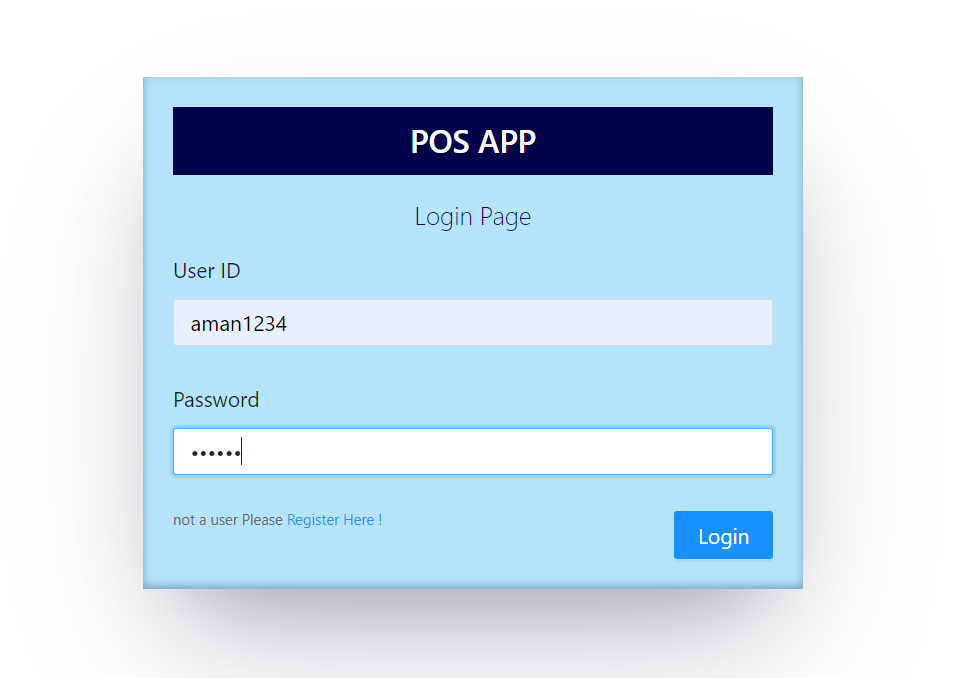
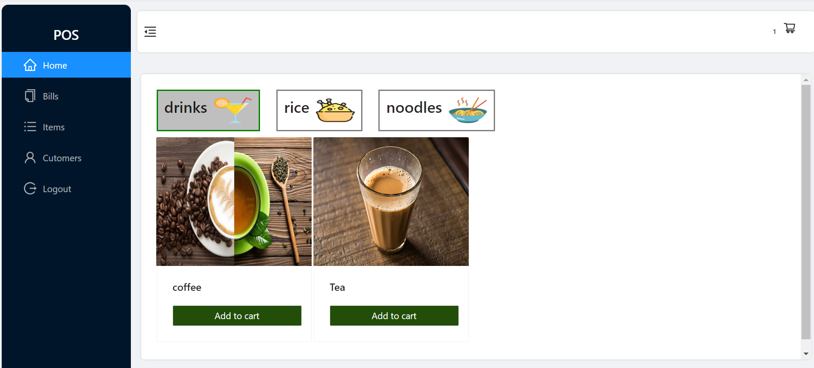
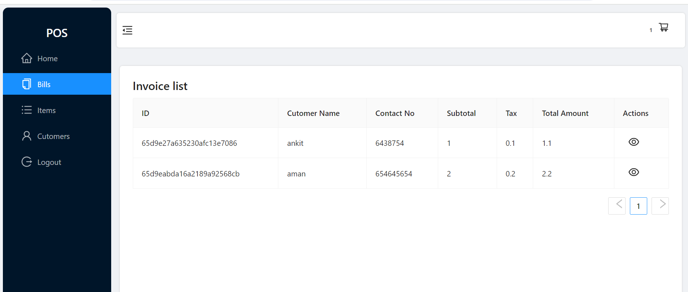
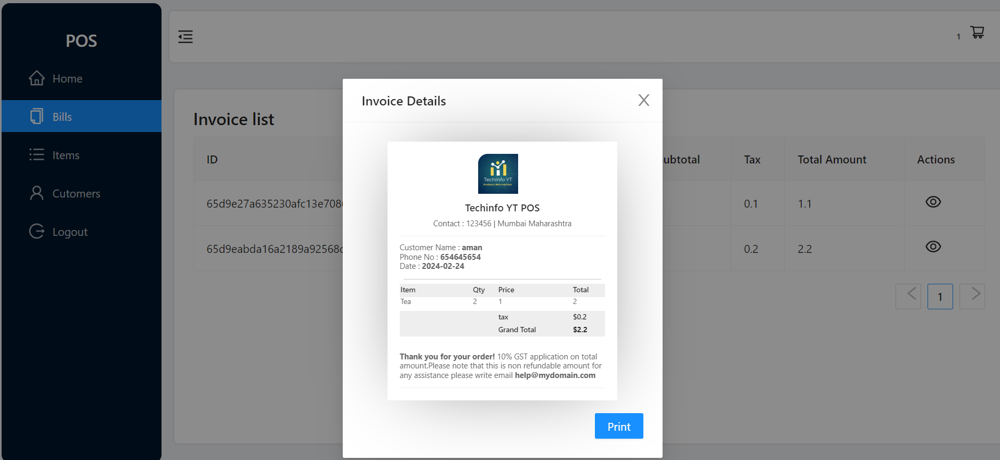
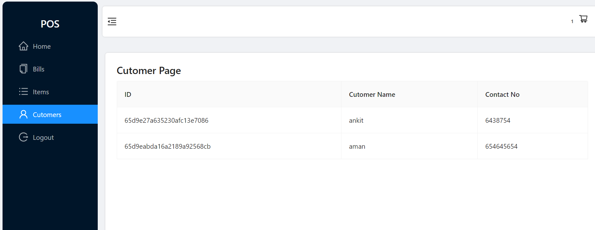

# MERN POS Application

Point of Sale (POS) application built using the MERN stack (MongoDB, Express.js, React.js, Node.js). The application provides functionalities for managing sales transactions, including user authentication, order processing, generating bills, and accessing customer details.

## Features

- **User Authentication:** Users can register and login securely to access the POS functionalities.
- **Ordering Food:** Users can select items from a menu, add them to their cart, and place orders.
- **Generating Bills:** The application automatically calculates the total amount due for each order and generates bills/receipts.
- **Customer Details:** Users can view and manage customer details associated with their orders.

## Technologies Used

- **Frontend:**
  - React.js
  - React Router for navigation
  - Redux for state management
  - Material-UI for UI components
- **Backend:**
  - Node.js
  - Express.js
  - MongoDB for database management
  - JWT (JSON Web Tokens) for user authentication
- **Others:**
  - Axios for handling HTTP requests
  - bcryptjs for password hashing

## Screenshots

## Usage

1. Register a new user account or login with existing credentials.
2. Navigate through the application to explore available features.
3. Place orders, generate bills, and manage customer details as required.

## Contributing

Contributions are welcome! Feel free to open issues or submit pull requests to contribute to the development of this application.

## License

This project is licensed under the MIT License - see the [LICENSE](LICENSE) file for details.

---
